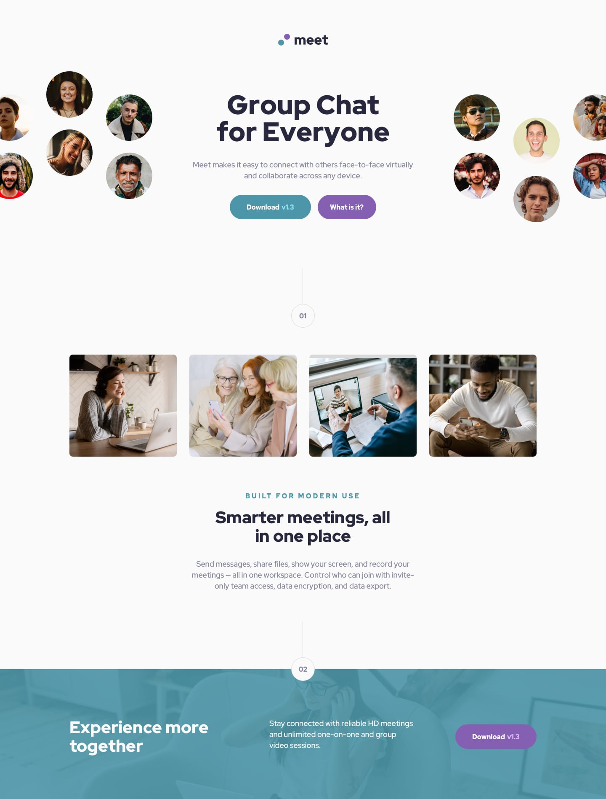

# Frontend Mentor - Meet landing page solution

This is a solution to the [Meet landing page challenge on Frontend Mentor](https://www.frontendmentor.io/challenges/meet-landing-page-rbTDS6OUR). Frontend Mentor challenges help you improve your coding skills by building realistic projects. 

## Table of contents

- [Overview](#overview)
    - [The challenge](#the-challenge)
    - [Screenshot](#screenshot)
    - [Links](#links)
- [Author](#author)

## Overview

### The challenge

Users should be able to:

- View the optimal layout for the page depending on their device's screen size
- See hover states for all interactive elements on the page

### Screenshot

### Links

- Solution URL: [Github](https://github.com/FARCER/fm-challenge-13)
- Live Site URL: [Here](https://fm-challenge-13.vercel.app/)

## Author

- Website - [FrontCoder](https://youtube.com/c/frontcoder)
- Frontend Mentor - [@FARCER](https://www.frontendmentor.io/profile/FARCER)
